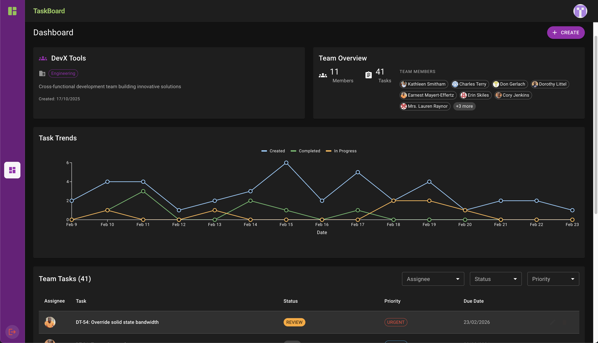

<div align="center">


# MirageJS ORM

> A TypeScript-first ORM for building in-memory databases with models, relationships, and factories

[](https://www.npmjs.com/package/miragejs-orm)
[](https://bundlejs.com/?q=miragejs-orm)
[](./LICENSE)
[]()
[](https://www.typescriptlang.org/)

</div>

---

## ✨ What is miragejs-orm?

**miragejs-orm** is a TypeScript rewrite of the ORM layer from MirageJS. Use it to build in-memory, type-safe mocks for frontend testing and development—no backend required. You get models, relationships, factories, and serialization through a modern, fluent API.

## 🚀 Why Choose miragejs-orm?

MirageJS excels at full API mocking; we took its ORM and rebuilt it for type safety and flexibility.

**Technical highlights**

- **🎯 TypeScript-first** — Full type safety and IDE support; no magic, no runtime schema.
- **🪶 Zero dependencies** — Smaller bundle (~55KB), no supply-chain surprises.
- **🔌 Framework agnostic** — Works with MSW, Mirage Server, Axios interceptors, or any test runner.
- **⚡ Fluent API** — Chainable builders for schemas, collections, models, and factories.
- **✅ Battle tested** — 900+ tests, 95% coverage, including type tests.
- **📦 No naming magic** — Mirage auto-derives singular/plural names and foreign keys for you. We don't: you write every model, attribute, and key name explicitly, so what you define is exactly what you get.

**What you get** — Develop UI-first with realistic data, model your API your way (or keep models minimal), and use built-in serialization for API-shaped output. One setup fits unit tests, integration tests, and Storybook.

## 💭 Philosophy

**Freedom, not rigidity** — You're never forced to mirror your backend's models or behavior. Define exactly the data each endpoint needs and manage it dynamically through the ORM, instead of hand-maintaining static fixture files.

**Schema-less, but type-safe** — No runtime validation. You keep test data correct; TypeScript keeps it type-safe at compile time. That trade-off keeps setup minimal and gives you full control without losing IDE safety.

**UI-first development** — The frontend owns the API contract. Model the data you expect and build against it without waiting on the backend. In the AI era this matters more than ever: agents can scaffold realistic mocks and endpoints in minutes, so the UI leads instead of waits.

---

<div align="center">

## 📂 Example mini-app



**[Task Board](./examples/task-board)** — [Open in CodeSandbox](https://codesandbox.io/p/devbox/condescending-dew-x7xmvs)

</div>

Not a toy demo — a small but complete app covering almost every case you hit in real-world frontends. It shows how to integrate miragejs-orm with a **MSW** mock server for request handling, **Vitest** (using its Context/Fixtures API) for isolated tests, and **Faker** for dynamic data generation. Use it to learn the library and as a template for your own mocks.

---

## 📑 Contents

- [MirageJS ORM](#miragejs-orm)
  - [✨ What is miragejs-orm?](#-what-is-miragejs-orm)
  - [🚀 Why Choose miragejs-orm?](#-why-choose-miragejs-orm)
  - [💭 Philosophy](#-philosophy)
  - [📂 Example mini-app](#-example-mini-app)
  - [📑 Contents](#-contents)
  - [📚 Docs](#-docs)
  - [📝 Articles](#-articles)
- [📖 Quick Guide](#-quick-guide)
  - [📦 Installation](#-installation)
  - [🏃 Quick Start](#-quick-start)
  - [📚 Core Concepts](#-core-concepts)
    - [1. Model Templates](#1-model-templates)
    - [2. Collections](#2-collections)
      - [Basic collection](#basic-collection)
      - [Full collection](#full-collection)
      - [Accessing models](#accessing-models)
      - [Creating models](#creating-models)
      - [Querying](#querying)
      - [Removing models](#removing-models)
    - [3. Relationships](#3-relationships)
      - [HasMany Relationship](#hasmany-relationship)
      - [BelongsTo Relationship](#belongsto-relationship)
      - [Many-to-Many Relationships](#many-to-many-relationships)
      - [Relation options](#relation-options)
    - [4. Factories](#4-factories)
      - [Basic Factory](#basic-factory)
      - [Derived attributes](#derived-attributes)
      - [Traits](#traits)
      - [Factory Associations](#factory-associations)
      - [Lifecycle Hooks](#lifecycle-hooks)
    - [5. Schema](#5-schema)
      - [Fixtures](#fixtures)
      - [Seeds](#seeds)
    - [6. Serializers](#6-serializers)
      - [Basic example](#basic-example)
      - [Method-level overrides](#method-level-overrides)
    - [7. Records vs Models](#7-records-vs-models)
    - [8. Collection vs ModelCollection](#8-collection-vs-modelcollection)
  - [🎯 Usage Examples](#-usage-examples)
    - [With MSW (Mock Service Worker)](#with-msw-mock-service-worker)
    - [In Testing (Jest)](#in-testing-jest)
    - [In Testing (Vitest Context)](#in-testing-vitest-context)
    - [In Storybook](#in-storybook)
  - [🔧 Advanced Features](#-advanced-features)
    - [Query Methods](#query-methods)
      - [Basic Queries](#basic-queries)
      - [Advanced Query Operators](#advanced-query-operators)
      - [Logical Operators (AND/OR/NOT)](#logical-operators-andornot)
      - [Pagination](#pagination)
      - [Combined Operations](#combined-operations)
    - [Custom Identity Managers](#custom-identity-managers)
    - [Custom Serializers](#custom-serializers)
    - [Debugging](#debugging)
    - [Direct Database Access](#direct-database-access)
  - [💡 TypeScript Best Practices](#-typescript-best-practices)
    - [Defining Model Template Types](#defining-model-template-types)
    - [Typing Schema](#typing-schema)
    - [Typing Model Instances](#typing-model-instances)
    - [Typing Collections](#typing-collections)
    - [Typing Factories](#typing-factories)
  - [📖 API Reference](#-api-reference)
  - [🤝 Contributing](#-contributing)
  - [📄 License](#-license)

---

## 📚 Docs

- [Migrating from MirageJS](./docs/migration-from-miragejs.md) — map the original MirageJS API to miragejs-orm.

---

## 📝 Articles

- [The Best Frontend Mocking ORM Was Trapped Inside MirageJS. So I Set It Free.](https://medium.com/@kyrylo.dev/the-best-frontend-mocking-orm-was-trapped-inside-miragejs-so-i-set-it-free-d877ca8d2a7e)

---

<div align="center">

# 📖 Quick Guide

</div>

## 📦 Installation

```bash
npm install miragejs-orm

# or
yarn add miragejs-orm

# or
pnpm add miragejs-orm
```

---

## 🏃 Quick Start

Here's a taste of what you can do with `miragejs-orm`:

```typescript
import { model, schema, collection, factory, relations } from 'miragejs-orm';

// 1. Define your models
const userModel = model()
  .name('user')
  .collection('users')
  .attrs<{ id: string; name: string; email: string }>()
  .build();

const postModel = model()
  .name('post')
  .collection('posts')
  .attrs<{ id: string; title: string; content: string; authorId: string }>()
  .build();

// 2. Create factories with fake data
const userFactory = factory()
  .model(userModel)
  .attrs({
    name: () => 'John Doe',
    email: () => 'john@example.com',
  })
  .build();

// 3. Setup your schema with relationships
const testSchema = schema()
  .collections({
    users: collection()
      .model(userModel)
      .factory(userFactory)
      .relationships({
        posts: relations.hasMany(postModel),
      })
      .build(),

    posts: collection()
      .model(postModel)
      .relationships({
        author: relations.belongsTo(userModel, { foreignKey: 'authorId' }),
      })
      .build(),
  })
  .build();

// 4. Use it!
const user = testSchema.users.create({ name: 'Alice' });

const post = testSchema.posts.create({
  title: 'Hello World',
  content: 'My first post',
  authorId: user.id,
});

console.log(user.posts.length); // 1
console.log(post.author.name); // 'Alice'
```

---

## 📚 Core Concepts

### 1. Model Templates

**Model Templates** define the structure of your data entities. They're schema-less at runtime but fully typed at compile time, and are **shareable and immutable** — reference the same template across relationships and collections for consistent type inference.

```typescript
import { model } from 'miragejs-orm';

interface UserAttrs {
  id: string;
  name: string;
  email: string;
  role?: string;
}

const userModel = model()
  .name('user')
  .collection('users')
  .attrs<UserAttrs>()
  .build();
```

> **JavaScript users** — pass a plain object to `.attrs()` instead of a generic (e.g. `.attrs({ id: '', name: '', email: '' })`). The object shape gives the IDE good IntelliSense without TypeScript.

---

<details>
<summary><strong>model() builder API reference</strong></summary>

| Method                              | Parameters                                            | Description                                                              |
| ----------------------------------- | ----------------------------------------------------- | ------------------------------------------------------------------------ |
| `model()`                           | —                                                     | Start a new model template builder.                                      |
| `.name(modelName)`                  | `modelName`: singular name (e.g. `'user'`)            | Set the model name. You name forms explicitly — no inflection.           |
| `.collection(collectionName)`       | `collectionName`: plural form (e.g. `'users'`)        | Set the collection name.                                                 |
| `.attrs<TAttrs>()`                  | `TAttrs`: attributes interface (must include `id`)    | Declare the model's attribute types.                                     |
| `.json<TModel, TCollection?>()`     | `TModel`: model JSON, `TCollection?`: collection JSON | Declare the serialized output type returned by `.toJSON()` (see [Serializers](#6-serializers)). |
| `.build()`                          | —                                                     | Finalize and return the immutable template.                              |

</details>

---

### 2. Collections

Collections are containers for models that live in your schema. They handle creation, querying, and access; collection methods return `Model` or `ModelCollection`, not raw records.

#### Basic collection

Only `.model()` is required. Everything else is optional.

```typescript
import { collection } from 'miragejs-orm';

const userCollection = collection()
  .model(userModel)
  .build();
```

#### Full collection

You can add relationships, factory, serializer, identity manager, seeds, and fixtures.

```typescript
import { collection, relations } from 'miragejs-orm';

const userCollection = collection()
  .model(userModel)
  .relationships({ posts: relations.hasMany(postModel) })
  .factory(userFactory)
  .serializer(userSerializer)
  .identityManager(identityManagerConfigOrInstance)
  .seeds((schema) => {...})
  .fixtures(userFixtures)
  .build();
```

---

<details>
<summary><strong>collection() builder API reference</strong></summary>

| Method                       | Parameters                                              | Description                                                                          |
| ---------------------------- | ------------------------------------------------------- | ------------------------------------------------------------------------------------ |
| `.model(template)`           | `template`: a model template                            | **Required.** Bind the collection to a model template.                               |
| `.relationships(config)`     | `config`: map of `relations.hasMany`/`belongsTo`        | Define this model's relationships (see [Relationships](#3-relationships)).            |
| `.factory(factory)`          | `factory`: a factory instance                           | Attach a factory for generating data (see [Factories](#4-factories)).                |
| `.serializer(configOrInstance)` | `SerializerConfig` or a `Serializer` instance       | Set serialization output (see [Serializers](#6-serializers)).                        |
| `.identityManager(config)`   | `config`: `IdentityManagerConfig`                       | Override ID generation for this collection (see [Custom Identity Managers](#custom-identity-managers)). |
| `.seeds(seeds)`              | `seeds`: a function or map of named scenarios           | Define seed data (see [Seeds](#seeds)).                                              |
| `.fixtures(records, options?)` | `records`: fixture array, `options.strategy?`: `'manual'` \| `'auto'` | Define static fixture data (see [Fixtures](#fixtures)).               |
| `.build()`                   | —                                                       | Finalize and return the collection config.                                           |

</details>

---

#### Accessing models

Get all models or access by position.

| Method      | Description                                                |
| ----------- | ---------------------------------------------------------- |
| `all()`     | Returns a `ModelCollection` of all models.                 |
| `first()`   | First model, or `null` if empty.                           |
| `last()`    | Last model, or `null` if empty.                            |
| `at(index)` | Model at zero-based index, or `undefined` if out of range. |

```typescript
const allUsers = testSchema.users.all();
const first = testSchema.users.first();
const last = testSchema.users.last();
const thirdUser = testSchema.users.at(2);
```

#### Creating models

Create and persist models. With a factory, you can use traits and defaults.

| Method                                     | Description                                                   |
| ------------------------------------------ | ------------------------------------------------------------- |
| `create(attrs?, ...traits)`                | Create one model. Pass attributes and/or factory trait names. |
| `createMany(count, attrs?, ...traits)`     | Create multiple models with the same attributes/traits.       |
| `findOrCreateBy(match, attrs?)`            | Find one model by predicate or create with given attributes.  |
| `findManyOrCreateBy(count, match, attrs?)` | Find up to `count` models by predicate or create to fill.     |

```typescript
// One model with custom attributes
const user = testSchema.users.create({
  name: 'Alice',
  email: 'alice@example.com',
});

// With factory traits
const adminUser = testSchema.users.create({ name: 'Admin' }, 'admin');

// Multiple identical models
const users = testSchema.users.createMany(3, 'admin');

// Multiple models with different attrs/traits per item
const users = testSchema.users.createMany([
  [{ name: 'Alice', email: 'alice@example.com' }],
  [{ name: 'Bob', email: 'bob@example.com' }],
  ['admin'],
]);

// Find or create
const user = testSchema.users.findOrCreateBy(
  { email: 'alice@example.com' },
  { name: 'Alice', role: 'user' },
);
const users = testSchema.users.findManyOrCreateBy(
  5,
  { role: 'user' },
  { isActive: true },
);
```

#### Querying

Find models, or check/count them, by ID or by conditions (`where` object or predicate function).

| Method                                       | Description                                                      |
| -------------------------------------------- | ---------------------------------------------------------------- |
| `find(id \| { where } \| QueryOptions)`      | One model (or `null`) by ID, predicate object, or query options. |
| `findMany(ids \| { where } \| QueryOptions)` | `ModelCollection` by IDs, predicate object, or query options.    |
| `count(where?)`                              | Number of models; optional `where` to filter.                    |
| `exists(where?)`                             | `true` if at least one model matches; optional `where` to filter. |

```typescript
// By ID
const user = testSchema.users.find('1');

// By conditions (object)
const admin = testSchema.users.find({ where: { role: 'admin' } });

// Many by IDs
const users = testSchema.users.findMany(['1', '2', '3']);

// Many with predicate function
const activeUsers = testSchema.users.findMany({
  where: (user) => user.isActive && user.role === 'admin',
});

// Count and existence checks
const adminCount = testSchema.users.count({ role: 'admin' });
const hasUsers = testSchema.users.exists();
const hasAlice = testSchema.users.exists({ email: 'alice@example.com' });
```

#### Removing models

Remove one model by ID, or many by IDs, predicate object, or query options.

| Method                                          | Description                                            |
| ----------------------------------------------- | ------------------------------------------------------ |
| `delete(id)`                                    | Remove one model by ID.                                |
| `deleteMany(ids \| { where } \| QueryOptions)`  | Remove matching models; returns the number removed.    |

```typescript
// One model by ID
testSchema.users.delete('1');

// Many by IDs
testSchema.users.deleteMany(['1', '2', '3']);

// Many by conditions (object)
testSchema.users.deleteMany({ status: 'inactive' });

// Many with query options
const removed = testSchema.users.deleteMany({
  where: { age: { lt: 18 } },
  limit: 10,
});
```

---

<details>
<summary><strong>Collection API reference</strong></summary>

| Method                                         | Returns              | Description                                                     |
| ---------------------------------------------- | -------------------- | --------------------------------------------------------------- |
| `all()`                                        | `ModelCollection`    | All models in the collection.                                   |
| `at(index)`                                    | `Model \| undefined` | Model at zero-based index.                                      |
| `count(where?)`                                | `number`             | Count models; optional `where` to filter.                       |
| `create(attrs?, ...traits)`                    | `Model`              | Create one model.                                               |
| `createMany(countOrSpec, attrs?, ...traits)`   | `ModelCollection`    | Create multiple models.                                         |
| `delete(id)`                                   | `void`               | Remove one model by ID.                                         |
| `deleteMany(ids \| predicate \| QueryOptions)` | `number`             | Remove matching models; returns count.                          |
| `exists(where?)`                               | `boolean`            | Whether at least one model matches; optional `where` to filter. |
| `find(id \| { where } \| QueryOptions)`        | `Model \| null`      | One model by ID, predicate, or query options.                   |
| `findMany(ids \| { where } \| QueryOptions)`   | `ModelCollection`    | Models by IDs, predicate, or query options.                     |
| `findManyOrCreateBy(count, match, attrs?)`     | `ModelCollection`    | Find up to count by predicate or create to fill.                |
| `findOrCreateBy(match, attrs?)`                | `Model`              | Find one by predicate or create.                                |
| `first()`                                      | `Model \| null`      | First model, or `null` if empty.                                |
| `last()`                                       | `Model \| null`      | Last model, or `null` if empty.                                 |
| `new(attrs)`                                   | `Model`              | In-memory only (not saved). Prefer `create()`.                  |

</details>

---

### 3. Relationships

Define relationships between models using **relations** in your collection configuration. Relations are used only for **schema relationship definitions**. For automatically creating or linking related records in factories, use **associations** (see Factory Associations).

```typescript
import { relations } from 'miragejs-orm';
```

#### HasMany Relationship

Use `relations.hasMany()` to define a one-to-many relationship where a model has multiple related records.

```typescript
// In users collection - define the relationship
relationships: {
  posts: relations.hasMany(postModel),
}

// Usage - access related records
const post = testSchema.posts.create({ title: 'Hello' });
const user = testSchema.users.create({ name: 'Alice', posts: [post] });

console.log(user.posts); // ModelCollection with the post
console.log(user.posts.length); // 1
```

#### BelongsTo Relationship

Use `relations.belongsTo()` to define a many-to-one relationship where a model belongs to another model.

```typescript
// In posts collection - define the relationship
relationships: {
  author: relations.belongsTo(userModel, { foreignKey: 'authorId' }),
}

// Usage - access the parent record
const post = testSchema.posts.find('1');
console.log(post.author.name); // Access related user
console.log(post.authorId); // The foreign key value
```

#### Many-to-Many Relationships

For many-to-many relationships, use `relations.hasMany()` on both sides with array foreign keys.

```typescript
import { model, schema, collection, relations } from 'miragejs-orm';

const studentModel = model()
  .name('student')
  .collection('students')
  .attrs<{ id: string; name: string; courseIds: string[] }>()
  .build();

const courseModel = model()
  .name('course')
  .collection('courses')
  .attrs<{ id: string; title: string; studentIds: string[] }>()
  .build();

const testSchema = schema()
  .collections({
    students: collection()
      .model(studentModel)
      .relationships({
        courses: relations.hasMany(courseModel, {
          foreignKey: 'courseIds',
        }),
      })
      .build(),

    courses: collection()
      .model(courseModel)
      .relationships({
        students: relations.hasMany(studentModel, {
          foreignKey: 'studentIds',
        }),
      })
      .build(),
  })
  .build();

// Usage - bidirectional access
const student = testSchema.students.create({
  name: 'Alice',
  courseIds: ['1', '2'],
});
console.log(student.courses.length); // 2
```

#### Relation options

**`foreignKey`** — override the attribute that stores the related ID.

- Defaults are derived from the **target model name**: `belongsTo(userModel)` → `userId`, `hasMany(postModel)` → `postIds`.
- Set it when your attribute name differs (e.g. `authorId` instead of `userId`).

```typescript
// Relationship name is `author`, but we store the ID in `authorId`
relationships: {
  author: relations.belongsTo(userModel, { foreignKey: 'authorId' }),
}
```

**`inverse`** — control the inverse side of the relationship for bidirectional sync.

- **Omit** for auto-detection (the default).
- Set to a **string** to name the inverse relationship explicitly.
- Set to **`null`** to disable synchronization.
- Use an explicit string when one model has multiple relationships to the same target (e.g. author vs reviewer).

```typescript
// User has two relationships to Post: authoredPosts and reviewedPosts.
// Each post has author and reviewer (both pointing to User).
// Explicit inverse pairs keep sync correct: author ↔ authoredPosts, reviewer ↔ reviewedPosts.
users: collection()
  .model(userModel)
  .relationships({
    authoredPosts: relations.hasMany(postModel, {
      foreignKey: 'authoredPostIds',
      inverse: 'author',
    }),
    reviewedPosts: relations.hasMany(postModel, {
      foreignKey: 'reviewedPostIds',
      inverse: 'reviewer',
    }),
  })
  .build(),

posts: collection()
  .model(postModel)
  .relationships({
    author: relations.belongsTo(userModel, {
      foreignKey: 'authorId',
      inverse: 'authoredPosts',
    }),
    reviewer: relations.belongsTo(userModel, {
      foreignKey: 'reviewerId',
      inverse: 'reviewedPosts',
    }),
  })
  .build(),
```

**`collectionName`** — override the collection key used when side-loading this relationship during serialization.

- Defaults to the **target model's collection name**.
- Set it when your serializer needs a different side-load key (e.g. `'articles'` instead of `'posts'`).

---

<details>
<summary><strong>relations utilities API reference</strong></summary>

| Utility                          | Parameters                                                | Description                                                                  |
| -------------------------------- | --------------------------------------------------------- | ---------------------------------------------------------------------------- |
| `relations.hasMany(target, opts?)`   | `target`: model template, `opts?`: relation options   | One-to-many. Stores an array foreign key (default `<model>Ids`).             |
| `relations.belongsTo(target, opts?)` | `target`: model template, `opts?`: relation options   | Many-to-one. Stores a single foreign key (default `<model>Id`).              |

**`opts`** (all optional):

| Option           | Type                | Description                                                                            |
| ---------------- | ------------------- | ------------------------------------------------------------------------------------- |
| `foreignKey`     | `string`            | Attribute storing the related ID. Default derived from target model name.             |
| `inverse`        | `string` \| `null`  | Inverse relationship name, or `null` to disable sync. Omit to auto-detect.            |
| `collectionName` | `string`            | Collection key for side-loading during serialization. Defaults to target's collection. |

</details>

---

### 4. Factories

Factories help you generate realistic test data with minimal boilerplate.

#### Basic Factory

```typescript
import { factory } from 'miragejs-orm';
import { faker } from '@faker-js/faker';

const userFactory = factory()
  .model(userModel)
  .attrs({
    name: () => faker.person.fullName(),
    email: () => faker.internet.email(),
    role: 'user', // Static default
  })
  .build();
```

#### Derived attributes

When one attribute depends on another (e.g. email from name), just read the other attribute off `this` inside an attr function. Attribute functions are evaluated lazily, so `this.name` always returns the **resolved** value — whether `name` was defined as a static value or a function. You never need to check whether it's a function or call it yourself.

```typescript
import { factory } from 'miragejs-orm';
import { faker } from '@faker-js/faker';

const userFactory = factory()
  .model(userModel)
  .attrs({
    name: () => faker.person.fullName(),
    email() {
      const name = this.name; // resolved value, e.g. 'John Doe'
      return `${name.split(' ').join('.').toLowerCase()}@example.com`;
    },
    role: 'user',
  })
  .build();

// Creates e.g. { name: 'John Doe', email: 'john.doe@example.com', role: 'user' }
testSchema.users.create();
```

Dependencies are resolved on demand and each attribute function runs at most once, so chains like `bio` → `email` → `name` work and circular dependencies are detected and reported.

#### Traits

Traits allow you to create variations of your factory:

```typescript
import { factory, associations } from 'miragejs-orm';
import { faker } from '@faker-js/faker';

const userFactory = factory()
  .model(userModel)
  .attrs({
    name: () => faker.person.fullName(),
    email: () => faker.internet.email(),
    role: 'user',
  })
  .traits({
    admin: {
      role: 'admin',
    },
    verified: {
      emailVerified: true,
      afterCreate(model) {
        // Custom logic after creation
        model.update({ verifiedAt: new Date().toISOString() });
      },
    },
    withPosts: {
      posts: associations.createMany(postModel, 3),
    },
  })
  .build();

// Usage
testSchema.users.create(); // Regular user
testSchema.users.create('admin'); // Admin user
testSchema.users.create('admin', 'verified'); // Admin + verified
testSchema.users.create('withPosts'); // User with 3 posts
```

#### Factory Associations

Create related models automatically:

```typescript
import { factory, associations } from 'miragejs-orm';

const userFactory = factory()
  .model(userModel)
  .associations({
    // Create 3 identical posts
    posts: associations.createMany(postModel, 3),
  })
  .traits({
    withProfile: {
      profile: associations.create(profileModel),
    },
  })
  .build();

// Create multiple different related models
const authorFactory = factory()
  .model(userModel)
  .associations({
    posts: associations.createMany(postModel, [
      [{ title: 'First Post', published: true }],
      [{ title: 'Draft Post', published: false }],
      ['featured'], // Using a trait
    ]),
  })
  .build();

// Link to existing models (or create if missing)
const userFactory2 = factory()
  .model(userModel)
  .traits({
    withExistingPost: {
      post: associations.link(postModel), // Finds first existing post, creates one if none exist
    },
    withExistingPosts: {
      posts: associations.linkMany(postModel, 3), // Finds/creates up to 3 posts
    },
  })
  .build();
```

#### Lifecycle Hooks

Execute logic after model creation:

```typescript
import { factory } from 'miragejs-orm';
import { faker } from '@faker-js/faker';

const postFactory = factory()
  .model(postModel)
  .attrs({
    title: () => faker.lorem.sentence(),
    content: () => faker.lorem.paragraphs(),
  })
  .afterCreate((post, schema) => {
    // Automatically assign to first user
    const user = schema.users.first();
    if (user) {
      post.update({ author: user });
    }
  })
  .build();
```

> **Defaults vs traits** — attributes and associations on the factory (`.attrs()`, `.associations()`) are **defaults**; those from `.traits()` are **overrides**. Traits apply after all defaults are evaluated, so trait values win.

> **Build order** — `collection.create(...)` runs: (1) factory evaluates attrs/traits and resolves IDs (no associations yet); (2) collection saves the model so the parent exists; (3) factory creates or links associated models (they can now resolve the parent); (4) collection reloads and applies FK updates, including inverse sync. The parent is always saved before associations run.

---

<details>
<summary><strong>factory() builder API reference</strong></summary>

| Method                   | Parameters                                                  | Description                                                                 |
| ------------------------ | ----------------------------------------------------------- | --------------------------------------------------------------------------- |
| `.model(template)`       | `template`: a model template                                | **Required.** Bind the factory to a model template.                         |
| `.attrs(attributes)`     | `attributes`: map of static values or `(id) => value` fns   | Default attribute values for created models.                                |
| `.traits(traits)`        | `traits`: map of named override sets                        | Named variations applied on top of defaults (incl. `afterCreate`).          |
| `.associations(config)`  | `config`: map of `associations.*` helpers                   | Related models created/linked on every build.                              |
| `.afterCreate(hook)`     | `hook`: `(model, schema) => void`                           | Run logic after the model and its associations are created.                 |
| `.build()`               | —                                                           | Finalize and return the factory.                                            |

> **Typing** — call `factory<TestCollections>()` so `afterCreate` and association helpers (`associations.createMany<PostModel, TestCollections>(...)`) get full schema type inference and trait-name suggestions.

</details>

---

<details>
<summary><strong>associations utilities API reference</strong></summary>

| Utility                                | Parameters                                                              | Description                                              |
| -------------------------------------- | ----------------------------------------------------------------------- | -------------------------------------------------------- |
| `associations.create(model, ...tD)`    | `model`: template, `...tD`: traits/defaults                             | Always create one new related model.                     |
| `associations.createMany(model, n \| specs, ...tD)` | `model`: template, `n`: count or per-model `specs` array, `...tD`: traits/defaults | Always create N new related models.        |
| `associations.link(model, query?, ...tD)`   | `model`: template, `query?`: find predicate, `...tD`: traits/defaults | Find one existing model, else create one.            |
| `associations.linkMany(model, n, query?, ...tD)` | `model`: template, `n`: count, `query?`: find predicate, `...tD`: traits/defaults | Find up to N existing models, else create to fill. |

</details>

---

### 5. Schema

The schema is your in-memory database that ties everything together.

```typescript
import { schema } from 'miragejs-orm';

const testSchema = schema()
  .collections({
    users: userCollection,
    posts: postCollection,
    comments: commentCollection,
  })
  .build();

// Now you can use all collections
testSchema.users.create({ name: 'Alice' });
testSchema.posts.all();
```

#### Fixtures

Load initial data from fixtures. Fixtures are defined at the **collection level** and support a `strategy` option to control when they're loaded:

- `'manual'` (default) - Load fixtures manually by calling `loadFixtures()`
- `'auto'` - Load fixtures automatically during schema setup

```typescript
import { schema, collection } from 'miragejs-orm';

// Manual loading (default)
const testSchema = schema()
  .collections({
    users: collection()
      .model(userModel)
      .fixtures([
        { id: '1', name: 'Alice', email: 'alice@example.com' },
        { id: '2', name: 'Bob', email: 'bob@example.com' },
      ])
      .build(),
  })
  .build();

// Load fixtures manually when needed
testSchema.loadFixtures(); // Loads all collection fixtures
testSchema.users.loadFixtures(); // Or load for specific collection

// Automatic loading with strategy option
const autoSchema = schema()
  .collections({
    users: collection()
      .model(userModel)
      .fixtures(
        [
          { id: '1', name: 'Alice', email: 'alice@example.com' },
          { id: '2', name: 'Bob', email: 'bob@example.com' },
        ],
        { strategy: 'auto' }, // Fixtures load automatically during setup
      )
      .build(),
  })
  .build(); // Fixtures are already loaded!
```

#### Seeds

Define seed scenarios at the collection level for different testing contexts. For a single default scenario, pass a function:

```typescript
const userCollection = collection()
  .model(userModel)
  .factory(userFactory)
  .seeds((schema) => {
    schema.users.create({ name: 'Demo User', email: 'demo@example.com' });
  })
  .build();

// Load default seeds (e.g. when starting the mock server)
await testSchema.loadSeeds({ onlyDefault: true });
```

For multiple scenarios, use an object with named keys:

```typescript
import { collection, schema } from 'miragejs-orm';
import { faker } from '@faker-js/faker';

const userCollection = collection()
  .model(userModel)
  .factory(userFactory)
  .seeds({
    default: (schema) => {
      // Loaded when calling testSchema.loadSeeds({ onlyDefault: true })
      schema.users.create({
        name: 'Demo User',
        email: 'demo@example.com',
        role: 'user',
      });
    },
    userForm: (schema) => {
      // Create a user with all fields populated for form testing
      schema.users.create({
        name: 'John Doe',
        email: 'john.doe@example.com',
        role: 'admin',
        bio: 'Software developer with 10 years of experience',
        avatar: 'https://i.pravatar.cc/150?img=12',
        isActive: true,
        createdAt: new Date('2024-01-15').toISOString(),
      });
    },
    adminUser: (schema) => {
      // Create admin user for permission testing
      schema.users.create({
        name: 'Admin User',
        email: 'admin@example.com',
        role: 'admin',
      });
    },
  })
  .build();

const postCollection = collection()
  .model(postModel)
  .factory(postFactory)
  .seeds({
    postAuthor: (schema) => {
      // Create posts and assign a user to a random subset
      schema.posts.createMany(20);

      const user = schema.users.create({
        name: 'Alice Author',
        email: 'alice@example.com',
      });

      // Assign user to random 5 posts
      const allPosts = schema.posts.all().models;
      const randomPosts = faker.helpers.arrayElements(allPosts, 5);

      randomPosts.forEach((post) => {
        post.update({ author: user });
      });
    },
  })
  .build();

const testSchema = schema()
  .collections({
    users: userCollection,
    posts: postCollection,
  })
  .build();

// Load all seeds for all collections
await testSchema.loadSeeds();

// Or load seeds for a specific collection
await testSchema.users.loadSeeds();

// Or load a specific scenario for a collection
await testSchema.users.loadSeeds('userForm');
await testSchema.posts.loadSeeds('postAuthor');

// Load only default scenarios (e.g. for development mock server)
await testSchema.loadSeeds({ onlyDefault: true });
```

> **Default vs named seeds** — use the **default** scenario for your dev environment (`loadSeeds({ onlyDefault: true })` when starting the mock server) and **named** scenarios for specific test cases (`loadSeeds('userForm')`). Combining both gives a stable dev dataset plus targeted test data.

---

<details>
<summary><strong>schema() builder API reference</strong></summary>

| Method                       | Parameters                                  | Description                                                                       |
| ---------------------------- | ------------------------------------------- | --------------------------------------------------------------------------------- |
| `.collections(config)`       | `config`: map of collection configs         | **Required.** Register the schema's collections.                                  |
| `.identityManager(config)`   | `config`: `IdentityManagerConfig`           | Schema-wide default ID generation (see [Custom Identity Managers](#custom-identity-managers)). |
| `.logging(config)`           | `config`: `LoggerConfig`                    | Enable logging (see [Debugging](#debugging)).                                     |
| `.build()`                   | —                                           | Finalize and return the schema instance.                                          |

**Schema instance methods:**

| Method                                  | Description                                                                  |
| --------------------------------------- | ---------------------------------------------------------------------------- |
| `loadSeeds()`                           | Load all seeds for all collections.                                          |
| `loadSeeds(collectionName)`             | Load all seeds for one collection.                                           |
| `loadSeeds({ onlyDefault: true })`      | Load only the `default` scenario across collections.                         |
| `loadFixtures(collectionName?)`         | Load fixtures for all collections, or one by name.                           |
| `emptyData()`                           | Clear all records in all collections (wraps `db.emptyData()`).               |
| `db`                                    | The underlying `DB` instance (see [Direct Database Access](#direct-database-access)). |

</details>

---

### 6. Serializers

Serializers control how models are converted to JSON. Configure them per collection by passing a **SerializerConfig** object; the collection builds an internal serializer from it. Options can be overridden at call time via `model.serialize(options)`. Use the model template’s **`.json<T>()`** to declare the default shape returned by **`.toJSON()`**.

#### Basic example

Pass a **SerializerConfig** to the collection and use **`.json<TModel, TCollection?>()`** on the model template to set the TypeScript type returned by **`.toJSON()`**. That type is what you get from `user.toJSON()` and `collection.toJSON()`.

```typescript
import { model, collection, schema } from 'miragejs-orm';

interface UserAttrs {
  id: string;
  name: string;
  email: string;
  password: string;
  role: string;
}

// Shape of the serialized output (e.g. API response)
interface UserJSON {
  id: string;
  name: string;
  email: string;
  postIds: string[];
}

const userModel = model()
  .name('user')
  .collection('users')
  .attrs<UserAttrs>()
  .json<UserJSON>() // default type for .toJSON()
  .build();

const testSchema = schema()
  .collections({
    users: collection()
      .model(userModel)
      .serializer({
        select: ['id', 'name', 'email'],
        with: ['posts'],
      })
      .build(),
  })
  .build();

const user = testSchema.users.create(
  {
    name: 'Alice',
    email: 'alice@example.com',
    password: 'secret',
    role: 'admin',
  },
  'withPosts',
);

// Type of `json` is UserJSON — matches the type passed to .json<UserJSON>()
const json = user.toJSON();
```

#### Method-level overrides

Use **`model.serialize(options)`** to override the collection serializer options at call time. When the resulting shape differs from the default (e.g. you pass a different `select` or a custom Serializer instance), use the **generic** **`serialize<TCustomJSON>(...)`** so the return type reflects the custom serialization:

```typescript
interface UserData {
  data: {
    id: string;
    name: string;
  };
}
const summary: UserData = user.serialize<UserData>({
  select: ['id', 'name'],
  root: 'data',
});
```

> **One level of nesting** — only one level of nested `with` is supported when serializing related models. Keep related payloads one level deep.

---

<details>
<summary><strong>SerializerConfig API reference</strong></summary>

| Option          | Type                                                          | Description                                                                                                                                                                                                                    |
| --------------- | ------------------------------------------------------------- | ------------------------------------------------------------------------------------------------------------------------------------------------------------------------------------------------------------------------------ |
| `select`        | `string[]` or `Record<string, boolean>`                       | Which attributes to include. **Array:** only listed keys (e.g. `['id', 'name', 'email']`). **Object:** `{ key: true }` include, `{ key: false }` exclude (include all others).                                                 |
| `with`          | `string[]` or `Record<string, boolean \| { select?, mode? }>` | Which relationships to include and how. **Array:** names to include (e.g. `['posts', 'author']`). **Object:** `{ relationName: true \| false }` or `{ relationName: { select: [...], mode: 'embedded' } }` for nested options. |
| `relationsMode` | `string`                                                      | How to output relationships. Default: `'foreignKey'`. See values below. Per-relation override: `with: { posts: { mode: 'embedded' } }`.                                                                                        |
| `root`          | `boolean` or `string`                                         | Wrap output in a root key. See values below. Default: `false`.                                                                                                                                                                 |

**`relationsMode` values**

| Value                     | Description                                                                    |
| ------------------------- | ------------------------------------------------------------------------------ |
| `'foreignKey'`            | Only foreign key IDs; no nested relationship data.                             |
| `'embedded'`              | Relationships nested in the model; foreign keys removed.                       |
| `'embedded+foreignKey'`   | Nested and keep foreign keys.                                                  |
| `'sideLoaded'`            | Relationships at top level (requires `root`). BelongsTo as single-item arrays. |
| `'sideLoaded+foreignKey'` | Same and keep foreign keys in attributes.                                      |

**`root` values**

| Value    | Effect                                                    |
| -------- | --------------------------------------------------------- |
| `true`   | Use model/collection name (e.g. `{ user: { ... } }`).     |
| `false`  | No wrapping (default).                                    |
| `string` | Custom key (e.g. `'userData'` → `{ userData: { ... } }`). |

</details>

---

### 7. Records vs Models

Understanding the distinction between **Records** and **Models** is fundamental to working with miragejs-orm:

**Records** are plain JavaScript objects stored in the database (`DbCollection`). They contain:

- Simple data attributes (name, email, etc.)
- Foreign keys (userId, postIds, etc.)
- An `id` field
- No methods or behavior

**Models** are class instances that wrap records and provide rich functionality:

- **`.attrs`** — The plain object that represents the record stored in the database (attributes and foreign keys). This is the same shape as the underlying record; attribute accessors like `user.name` read from it.
- All record attributes via accessors (`user.name`, `post.title`)
- Relationship accessors (`user.posts`, `post.author`)
- CRUD methods (`.save()`, `.update()`, `.destroy()`, `.reload()`)
- Relationship methods (`.related()`, `.link()`, `.unlink()`)
- Serialization (`.toJSON()`, `.toString()`, `.serializer()`)
- Status tracking (`.isNew()`, `.isSaved()`)

**ModelCollection** is a collection of Model instances. You get it from collection methods that return multiple models (`all()`, `findMany()`, `createMany()`) or from relationship accessors (`user.posts`). It supports most Array-like methods (operating over the models), exposes the underlying list via `.models`, and provides `.length` and serialization (`.toJSON()`). It is not the same as the schema **Collection** (e.g. `schema.users`), which is the container you use to create and query; the ModelCollection is the _result_ of those operations.

```typescript
// When you create a record, it materializes into a model instance
const user = testSchema.users.create({
  name: 'Alice',
  email: 'alice@example.com',
});

// The Model instance wraps a Record stored in the database
console.log(user instanceof Model); // true
console.log(user.attrs); // { id: '1', name: 'Alice', email: '...', postIds: [] } — the record in the DB
console.log(user.name); // 'Alice' - attribute accessor (reads from .attrs)
console.log(user.posts); // ModelCollection - relationship accessor

// Models are materialized when:
// - Creating: testSchema.users.create(...)
// - Finding: testSchema.users.find('1')
// - Querying: testSchema.users.findMany({ where: ... })
// - Accessing relationships: user.posts (returns ModelCollection of Models)
```

**Why This Matters:**

- 🗄️ **Storage Efficiency** - The database stores lightweight records, not heavy model instances
- 🔄 **Fresh Data** - Each query materializes new model instances with the latest record data
- 🎯 **Type Safety** - Models provide type-safe accessors and methods, records are just data
- 🔗 **Relationships** - Models handle relationship logic, records only store foreign keys

---

<details>
<summary><strong>Model API reference</strong></summary>

| Method / property          | Returns                            | Description                                                                 |
| -------------------------- | ---------------------------------- | --------------------------------------------------------------------------- |
| `attrs`                    | `object`                           | The record stored in the DB (copy of attributes and foreign keys).          |
| `id`                       | `string \| number \| null`         | The model ID (or `null` if unsaved).                                        |
| `destroy()`                | `this`                             | Remove the model from the DB; model becomes "new" (no id).                  |
| `isNew()`                  | `boolean`                          | Whether the model is not yet saved to the DB.                               |
| `isSaved()`                | `boolean`                          | Whether the model exists in the DB.                                         |
| `link(relName, target)`    | `this`                             | Link this model to another via a relationship (updates FKs and inverse).    |
| `related(relName)`         | `Model \| ModelCollection \| null` | Get the related model(s) for a relationship.                                |
| `reload()`                 | `this`                             | Reload attributes from the DB.                                              |
| `save()`                   | `this`                             | Insert or update the record in the DB.                                      |
| `serialize(options?)`      | `TSerialized`                      | Serialize with optional overrides or a custom Serializer; generic for type. |
| `toJSON()`                 | `TSerialized`                      | Serialize using the collection serializer (default options).                |
| `toString()`               | `string`                           | Simple string representation (e.g. `model:user(1)`).                        |
| `unlink(relName, target?)` | `this`                             | Unlink a relationship (optional target for hasMany).                        |
| `update(attrs)`            | `this`                             | Merge attributes and save to the DB.                                        |

</details>

---

### 8. Collection vs ModelCollection

These two are easy to confuse because both hold models, but they sit on opposite ends of an operation.

**Collection** (e.g. `schema.users`) is the **schema container** you configure and call. It's the entry point for creating, finding, querying, and deleting models. You set it up once with `collection().model(...).build()` and access it as a property on the schema.

**ModelCollection** is the **result** of an operation that returns multiple models — `all()`, `findMany()`, `createMany()`, or a `hasMany` relationship accessor like `user.posts`. It's a lightweight wrapper around an array of `Model` instances: it supports most Array methods (`map`, `filter`, `forEach`, …) operating over the models, exposes the raw array via `.models`, and adds `.length` plus serialization via `.toJSON()`.

```typescript
// Collection — the container you call
const users = testSchema.users; // Collection
const alice = users.create({ name: 'Alice' }); // Model

// ModelCollection — what those calls return
const all = testSchema.users.all(); // ModelCollection
const admins = testSchema.users.findMany({ where: { role: 'admin' } }); // ModelCollection
const posts = alice.posts; // ModelCollection (hasMany relationship)

// ModelCollection is array-like
admins.length; // number
admins.map((u) => u.name); // operates over Model instances
admins.models; // underlying Model[]
admins.toJSON(); // serialized output
```

| | Collection | ModelCollection |
| --------------- | ------------------------------------------------ | ------------------------------------------------------ |
| **What it is** | Schema container | Result of a multi-model operation |
| **How you get it** | `schema.users` | `all()`, `findMany()`, `createMany()`, `user.posts` |
| **Use it to** | Create, find, query, delete | Iterate, transform, count, serialize a result set |

---

<div align="center">

## 🎯 Usage Examples

</div>

### With MSW (Mock Service Worker)

```typescript
import { http, HttpResponse } from 'msw';
import { setupServer } from 'msw/node';
import { schema, model, collection, factory } from 'miragejs-orm';

// Setup your schema
const testSchema = schema()
  .collections({
    users: collection().model(userModel).factory(userFactory).build(),
  })
  .build();

// Seed data
testSchema.users.createMany(10);

// Create MSW handlers
const handlers = [
  http.get('/api/users', () => {
    const users = testSchema.users.all();
    return HttpResponse.json({ users: users.toJSON() });
  }),

  http.get('/api/users/:id', ({ params }) => {
    const user = testSchema.users.find(params.id as string);
    if (!user) {
      return new HttpResponse(null, { status: 404 });
    }
    return HttpResponse.json(user.toJSON());
  }),

  http.post('/api/users', async ({ request }) => {
    const body = await request.json();
    const user = testSchema.users.create(body);
    return HttpResponse.json(user.toJSON(), { status: 201 });
  }),
];

const server = setupServer(...handlers);
```

### In Testing (Jest)

With Jest, use a shared schema and reset the database in `beforeEach` so each test starts with a clean state:

```typescript
import { describe, it, expect, beforeEach } from '@jest/globals';
import { testSchema } from '@test/schema';

describe('User Management', () => {
  beforeEach(() => {
    testSchema.emptyData();
  });

  it('should create a user with posts', () => {
    const user = testSchema.users.create({
      name: 'Alice',
      email: 'alice@example.com',
    });

    testSchema.posts.createMany(3, { authorId: user.id });

    expect(user.posts.length).toBe(3);
    expect(user.posts.models[0].author.id).toBe(user.id);
  });

  it('should handle complex relationships', () => {
    const user1 = testSchema.users.create({ name: 'Alice' });
    const user2 = testSchema.users.create({ name: 'Bob' });

    const post = testSchema.posts.create({
      title: 'Hello',
      authorId: user1.id,
    });

    testSchema.comments.create({
      content: 'Great post!',
      postId: post.id,
      userId: user2.id,
    });

    expect(post.comments.length).toBe(1);
    expect(post.comments.models[0].user.name).toBe('Bob');
  });
});
```

### In Testing (Vitest Context)

With Vitest, you can inject the schema as a **fixture** so each test receives a `schema` argument and the DB is cleared after the test automatically. Extend Vitest’s `test` and use the extended `test` from your context:

```typescript
// test/context.ts
import { test as baseTest } from 'vitest';
import { testSchema } from './schema';

export const test = baseTest.extend<{ schema: typeof testSchema }>({
  schema: async ({}, use) => {
    await use(testSchema);
    testSchema.emptyData(); // Teardown: clean after each test
  },
});
```

```typescript
// features/users/api/createUser.test.ts
import { test, describe, expect } from '@test/context';

describe('createUser', () => {
  test('creates user and returns serialized', async ({ schema }) => {
    const result = await createUser({
      name: 'Alice',
      email: 'alice@example.com',
    });
    const user = schema.users.find(result.id)!;

    expect(result).toMatchObject({ name: user.name, email: user.email });
    expect(user).toBeDefined();
  });

  test('can create posts for user', async ({ schema }) => {
    const user = schema.users.create({ name: 'Bob', email: 'bob@example.com' });
    schema.posts.createMany(2, { authorId: user.id });

    expect(user.posts.length).toBe(2);
  });
});
```

Each test gets a fresh logical state: the same `testSchema` instance is used, and `emptyData()` runs after the fixture’s `use()` completes.

### In Storybook

```typescript
import type { Meta, StoryObj } from '@storybook/react';
import { UserList } from './UserList';
import { schema, model, collection, factory } from 'miragejs-orm';

// Setup mock data for stories
const setupMockData = (count: number) => {
  const testSchema = schema()
    .collections({
      users: collection()
        .model(userModel)
        .factory(userFactory)
        .build(),
    })
    .build();

  return testSchema.users.createMany(count);
};

const meta: Meta<typeof UserList> = {
  component: UserList,
  title: 'UserList',
};

export default meta;

export const Empty: StoryObj<typeof UserList> = {
  render: () => <UserList users={[]} />,
};

export const WithUsers: StoryObj<typeof UserList> = {
  render: () => {
    const users = setupMockData(5);
    return <UserList users={users.toJSON()} />;
  },
};

export const WithManyUsers: StoryObj<typeof UserList> = {
  render: () => {
    const users = setupMockData(50);
    return <UserList users={users.toJSON()} />;
  },
};
```

---

<div align="center">

## 🔧 Advanced Features

</div>

### Query Methods

MirageJS ORM provides powerful query capabilities including advanced operators, logical combinations, and pagination — features not available in standard MirageJS.

#### Basic Queries

```typescript
// Simple equality
const admins = testSchema.users.findMany({ where: { role: 'admin' } });

// Predicate function
const recentPosts = testSchema.posts.findMany({
  where: (post) => new Date(post.createdAt) > new Date('2024-01-01'),
});
```

#### Advanced Query Operators

```typescript
// Comparison operators
const youngUsers = testSchema.users.findMany({
  where: { age: { lt: 30 } }, // Less than
});

const adults = testSchema.users.findMany({
  where: { age: { gte: 18 } }, // Greater than or equal
});

const rangeUsers = testSchema.users.findMany({
  where: { age: { between: [25, 35] } }, // Between (inclusive)
});

// String operators
const gmailUsers = testSchema.users.findMany({
  where: { email: { like: '%@gmail.com' } }, // SQL-style wildcards
});

const nameSearch = testSchema.users.findMany({
  where: { name: { ilike: '%john%' } }, // Case-insensitive search
});

const usersStartingWithA = testSchema.users.findMany({
  where: { name: { startsWith: 'A' } },
});

// Null checks
const usersWithoutEmail = testSchema.users.findMany({
  where: { email: { isNull: true } },
});

// Array operators
const admins = testSchema.users.findMany({
  where: { tags: { contains: 'admin' } }, // Array includes value
});

const multipleRoles = testSchema.users.findMany({
  where: { tags: { contains: ['admin', 'moderator'] } }, // Array includes all values
});
```

**Available Operators:**

- Equality: `eq`, `ne`, `in`, `nin`, `isNull`
- Comparison: `lt`, `lte`, `gt`, `gte`, `between`
- String: `like`, `ilike`, `startsWith`, `endsWith`, `contains`
- Array: `contains`, `length`

#### Logical Operators (AND/OR/NOT)

```typescript
// AND - all conditions must match
const activeAdmins = testSchema.users.findMany({
  where: {
    AND: [{ status: 'active' }, { role: 'admin' }],
  },
});

// OR - at least one condition must match
const flaggedUsers = testSchema.users.findMany({
  where: {
    OR: [{ status: 'suspended' }, { age: { lt: 18 } }],
  },
});

// NOT - negate condition
const nonAdmins = testSchema.users.findMany({
  where: {
    NOT: { role: 'admin' },
  },
});

// Complex combinations
const eligibleUsers = testSchema.users.findMany({
  where: {
    AND: [
      {
        OR: [{ status: 'active' }, { status: 'pending' }],
      },
      { NOT: { age: { lt: 18 } } },
      { email: { like: '%@company.com' } },
    ],
  },
});
```

#### Pagination

**Offset-based (Standard)**

```typescript
// Page 1: First 10 users
const page1 = testSchema.users.findMany({
  limit: 10,
  offset: 0,
});

// Page 2: Next 10 users
const page2 = testSchema.users.findMany({
  limit: 10,
  offset: 10,
});

// Combined with filtering and sorting
const activeUsersPage2 = testSchema.users.findMany({
  where: { status: 'active' },
  orderBy: { createdAt: 'desc' },
  offset: 20,
  limit: 10,
});
```

**Cursor-based (Keyset) Pagination**

More efficient for large datasets and prevents inconsistencies when data changes between requests.

```typescript
// First page
const firstPage = testSchema.users.findMany({
  orderBy: { createdAt: 'desc' },
  limit: 10,
});

// Next page using last item as cursor
const lastUser = firstPage[firstPage.length - 1];
const nextPage = testSchema.users.findMany({
  orderBy: { createdAt: 'desc' },
  cursor: { createdAt: lastUser.createdAt },
  limit: 10,
});

// Multi-field cursor for unique sorting
const page = testSchema.users.findMany({
  orderBy: [
    ['score', 'desc'],
    ['createdAt', 'asc'],
  ],
  cursor: { score: 100, createdAt: new Date('2024-01-15') },
  limit: 20,
});
```

#### Combined Operations

```typescript
// Complex query with all features
const results = testSchema.users.findMany({
  where: {
    AND: [
      { status: 'active' },
      {
        OR: [{ role: 'admin' }, { tags: { contains: 'premium' } }],
      },
      { age: { gte: 18 } },
    ],
  },
  orderBy: [
    ['lastActive', 'desc'],
    ['name', 'asc'],
  ],
  offset: 20,
  limit: 10,
});
```

### Custom Identity Managers

Control how IDs are generated via **IdentityManagerConfig** (no need to define a custom class). You can set a default at the **schema level** and override per **collection**.

**Config options:** `initialCounter` (required), optional `initialUsedIds`, optional `idGenerator(currentId) => nextId`.

```typescript
import { schema, collection, IdentityManager } from 'miragejs-orm';
import type { IdentityManagerConfig } from 'miragejs-orm';

// Global default: string IDs starting at "1" (schema-level)
const testSchema = schema()
  .identityManager({ initialCounter: '1' })
  .collections({
    users: userCollection,
    posts: postCollection,
  })
  .build();

// Per-collection override: number IDs for posts only
const postCollection = collection()
  .model(postModel)
  .identityManager({ initialCounter: 1 })
  .build();

// Custom id generator (e.g. UUIDs)
const uuidConfig: IdentityManagerConfig<string> = {
  initialCounter: '0',
  idGenerator: () => crypto.randomUUID(),
};
const usersCollection = collection()
  .model(userModel)
  .identityManager(uuidConfig)
  .build();

// You can also pass an IdentityManager instance per collection
const customManager = new IdentityManager({ initialCounter: 100 });
collection().model(postModel).identityManager(customManager).build();
```

### Custom Serializers

Extend the **Serializer** class when you need a reusable, named serializer with custom logic. Override `serialize()` or `serializeCollection()` and call `super.serialize()` / `super.serializeCollection()` to use the default behavior, then adjust the result. When the custom serializer is passed to the collection, you can use **`.toJSON()`** on the model or collection instead of calling the serializer directly.

```typescript
import { model, collection, schema, Serializer } from 'miragejs-orm';
import type {
  ModelInstance,
  ModelCollection,
  SerializerConfig,
} from 'miragejs-orm';

// Custom serialized types (optional — use .json() so toJSON() is typed)
interface UserJSON {
  id: string;
  name: string;
  email: string;
  role: string;
  displayName: string;
}
interface UserListJSON {
  data: UserJSON[];
}

const userModel = model()
  .name('user')
  .collection('users')
  .attrs<{ id: string; name: string; email: string; role: string }>()
  .json<UserJSON, UserListJSON>()
  .build();

// Custom serializer: add computed fields; wrap list response in a "data" envelope
class UserApiSerializer extends Serializer<typeof userModel, TestCollections> {
  serialize(
    model: ModelInstance<typeof userModel, TestCollections>,
    options?: Partial<SerializerConfig<typeof userModel, TestCollections>>,
  ) {
    const json = super.serialize(model, options);
    json.displayName = `${model.name} (${model.email})`;
    return json;
  }

  serializeCollection(
    collection: ModelCollection<typeof userModel, TestCollections>,
    options?: Partial<SerializerConfig<typeof userModel, TestCollections>>,
  ) {
    const json = super.serializeCollection(collection, options);
    const items = json[this.collectionName];
    return { data: items, size: items.length };
  }
}

const userSerializer = new UserApiSerializer(userModel, {
  select: ['id', 'name', 'email', 'role'],
});

const testSchema = schema()
  .collections({
    users: collection().model(userModel).serializer(userSerializer).build(),
  })
  .build();

const user = testSchema.users.create({
  name: 'Alice',
  email: 'alice@example.com',
  role: 'user',
});
const users = testSchema.users.all();

// Option 1: use .toJSON() (uses the collection's serializer)
const singleJson: UserJSON = user.toJSON();
// { id: '1', name: 'Alice', email: 'alice@example.com', role: 'user', displayName: 'Alice (alice@example.com)' }

const listJson: UserListJSON = users.toJSON();
// { data: [{ id: '1', name: 'Alice', email: 'alice@example.com', role: 'user', displayName: '...' }, ...], size }

// Option 2: call the serializer directly (e.g. in handlers or when you hold a serializer reference)
userSerializer.serialize(user);
userSerializer.serializeCollection(users);
```

### Debugging

Enable logging to understand what the ORM is doing under the hood. This is invaluable for debugging tests, understanding query behavior, and troubleshooting data issues.

**Enable Logging:**

```typescript
import { schema, LogLevel } from 'miragejs-orm';

const testSchema = schema()
  .collections({
    users: userCollection,
    posts: postCollection,
  })
  .logging({
    enabled: true,
    level: LogLevel.DEBUG, // or 'debug'
  })
  .build();
```

**Log Levels:** Use the `LogLevel` enum or string equivalents.

```typescript
import { schema, LogLevel } from 'miragejs-orm';

// Debug - Most verbose, shows all operations
schema().logging({ enabled: true, level: LogLevel.DEBUG });
// Output: Schema initialization, collection registration, create/find operations, query details

// Info - Important operations and results
schema().logging({ enabled: true, level: LogLevel.INFO });
// Output: Fixtures loaded, seeds loaded, high-level operations

// Warn - Potential issues and unusual patterns
schema().logging({ enabled: true, level: LogLevel.WARN });
// Output: Foreign key mismatches, deprecated usage

// Error - Only failures and validation errors
schema().logging({ enabled: true, level: LogLevel.ERROR });
// Output: Operation failures, validation errors

// Silent - No logging (default)
schema().logging({ enabled: true, level: LogLevel.SILENT });
```

**Custom Prefix:**

```typescript
import { schema } from 'miragejs-orm';

const testSchema = schema()
  .collections({ users: userCollection })
  .logging({
    enabled: true,
    level: 'debug',
    prefix: '[MyApp Test]', // Custom prefix instead of default '[Mirage]'
  })
  .build();

// Output: [MyApp Test] DEBUG: Schema initialized
```

**What Gets Logged:**

```typescript
import { schema, collection, LogLevel } from 'miragejs-orm';

const testSchema = schema()
  .logging({ enabled: true, level: LogLevel.DEBUG })
  .collections({
    users: collection()
      .model(userModel)
      .factory(userFactory)
      .fixtures([{ id: '1', name: 'Alice' }])
      .seeds({ testData: (schema) => schema.users.create({ name: 'Bob' }) })
      .build(),
  })
  .build();

// Console output:
// [Mirage] DEBUG: Registering collections { count: 1, names: ['users'] }
// [Mirage] DEBUG: Collection 'users' initialized { modelName: 'user' }
// [Mirage] DEBUG: Schema initialized { collections: ['users'] }

// Load fixtures
testSchema.loadFixtures();
// [Mirage] INFO: Fixtures loaded successfully for 'users' { count: 1 }

// Create a record
testSchema.users.create({ name: 'Charlie' });
// [Mirage] DEBUG: Creating user { collection: 'users' }
// [Mirage] DEBUG: Created user with factory { collection: 'users', id: '2' }

// Query records
const users = testSchema.users.findMany({ where: { name: 'Charlie' } });
// [Mirage] DEBUG: Query 'users': findMany
// [Mirage] DEBUG: Query 'users' returned 1 records

// Load seeds for a specific scenario
testSchema.users.loadSeeds('testData');
// [Mirage] INFO: Seeds loaded successfully for 'users' { scenario: 'testData' }
```

**Use Cases:**

```typescript
import { schema, LogLevel } from 'miragejs-orm';

// Development - See what's happening
const devSchema = schema()
  .collections({ users: userCollection })
  .logging({ enabled: true, level: LogLevel.INFO })
  .build();

// Testing - Debug failing tests
const testSchema = schema()
  .collections({ users: userCollection })
  .logging({
    enabled: process.env.DEBUG === 'true', // Enable via env var
    level: LogLevel.DEBUG,
  })
  .build();
```

### Direct Database Access

For low-level operations, use `schema.db` to get the **DB** instance and `schema.db[collectionName]` or `schema[collectionName].dbCollection` to get a **DbCollection**. These work with raw records (plain objects), not Model instances.

```typescript
// Access raw database
const rawUsers = testSchema.db.users.all();

// Batch operations
testSchema.db.emptyData(); // Clear all data
testSchema.db.users.insert({ id: '1', name: 'Alice' });
testSchema.db.users.delete('1');
```

---

<details>
<summary><strong>DB API reference</strong></summary>

| Method                               | Returns                             | Description                                                            |
| ------------------------------------ | ----------------------------------- | ---------------------------------------------------------------------- |
| `createCollection(name, config?)`    | `this`                              | Create a new collection (name, optional initialData, identityManager). |
| `dump()`                             | `Record<collectionName, TRecord[]>` | Dump all collection data as a plain object.                            |
| `emptyData()`                        | `void`                              | Clear all records in all collections.                                  |
| `getCollection(name)`                | `DbCollection`                      | Get a collection by name. Throws if missing.                           |
| `hasCollection(name)`                | `boolean`                           | Whether a collection exists.                                           |
| `identityManagerFor(collectionName)` | `IdentityManager`                   | Get the identity manager for a collection.                             |
| `loadData(data)`                     | `this`                              | Load initial data into existing or new collections.                    |

Access collections dynamically as properties: `schema.db.users`, `schema.db.posts`, etc. (each returns a **DbCollection**).

</details>

---

<details>
<summary><strong>DbCollection API reference</strong></summary>

| Method / property                              | Returns                          | Description                                       |
| ---------------------------------------------- | -------------------------------- | ------------------------------------------------- |
| `all()`                                        | `TRecord[]`                      | All records in the collection.                    |
| `at(index)`                                    | `TRecord \| undefined`           | Record at zero-based index.                       |
| `clear()`                                      | `void`                           | Remove all records; reset identity manager.       |
| `count(where?)`                                | `number`                         | Count records; optional `where` to filter.        |
| `delete(id)`                                   | `boolean`                        | Remove one record by ID.                          |
| `deleteMany(ids \| predicate \| QueryOptions)` | `number`                         | Remove matching records; returns count.           |
| `exists(where?)`                               | `boolean`                        | Whether at least one record matches.              |
| `find(id \| predicate \| QueryOptions)`        | `TRecord \| null`                | One record by ID, predicate, or query options.    |
| `findMany(ids \| predicate \| QueryOptions)`   | `TRecord[]` or `PaginatedResult` | Records by IDs, predicate, or query options.      |
| `first()`                                      | `TRecord \| undefined`           | First record.                                     |
| `has(id)`                                      | `boolean`                        | Whether a record with that ID exists.             |
| `identityManager`                              | `IdentityManager`                | ID generator for this collection.                 |
| `insert(data)`                                 | `TRecord`                        | Insert one record (ID auto-generated if omitted). |
| `insertMany(data[])`                           | `TRecord[]`                      | Insert multiple records.                          |
| `isEmpty`                                      | `boolean`                        | Whether the collection has no records.            |
| `last()`                                       | `TRecord \| undefined`           | Last record.                                      |
| `name`                                         | `string`                         | Collection name.                                  |
| `nextId`                                       | `TRecord['id']`                  | Next ID from the identity manager.                |
| `size`                                         | `number`                         | Number of records.                                |
| `update(id, patch)`                            | `TRecord \| null`                | Update one record by ID.                          |
| `updateMany(input, patch)`                     | `TRecord[]`                      | Update multiple records.                          |

</details>

---

<div align="center">

## 💡 TypeScript Best Practices

</div>

MirageJS ORM is built with TypeScript-first design. Here are best practices for getting the most out of type safety.

### Defining Model Template Types

Use `typeof` to create reusable model template types that can be shared across your schema:

```typescript
// -- @test/schema/models/userModel.ts --
import { model } from 'miragejs-orm';
import type { User } from '@domain/users/types';

// Define user model attributes type
export type UserAttrs = { id: string; name: string; email: string; role: string };
// Define user model output type to be produced during serialization
export type UserJSON = { user: User; current?: boolean };

// Create user model template
export const userModel = model()
  .name('user')
  .collection('users')
  .attrs<UserAttrs>()
  .json<UserJSON, User[]>()
  .build();

// Define a shareable user model type
export type UserModel = typeof userModel;
```

```typescript
// -- @test/schema/models/postModel.ts --
import { model } from 'miragejs-orm';
import type { Post } from '@domain/posts/types';

// Define post attributes type
export type PostAttrs = { id: string; title: string; content: string; authorId: string };

// Create post model template
export const postModel = model()
  .name('post')
  .collection('posts')
  .attrs<PostAttrs>()
  .json<Post, Post[]>() // Use existing Post entity type without transformations
  .build();

// Define shareable post model type
export type PostModel = typeof postModel;
```

```typescript
// -- @test/schema/collections/usersCollection.ts --
// Use shareable model types in your collections
import {
  userModel,
  postModel,
  type UserModel,
  type PostModel,
} from '@test/schema/models';
```

### Typing Schema

Define explicit schema types for use across your application (e.g. `TestSchema` / `TestCollections` for a test schema):

```typescript
// -- @test/schema/schema.ts or types.ts --
import { collection, relations, schema } from 'miragejs-orm';
import type {
  BelongsTo,
  CollectionConfig,
  Factory,
  HasMany,
  SchemaInstance,
} from 'miragejs-orm';
import type { UserModel, PostModel } from './models';

// Define your schema collections type
export type TestCollections = {
  users: CollectionConfig<
    UserModel,
    { posts: HasMany<PostModel> },
    Factory<UserModel, 'admin' | 'verified', TestCollections>,
    TestCollections
  >;
  posts: CollectionConfig<
    PostModel,
    { author: BelongsTo<UserModel, 'authorId'> },
    Factory<PostModel, 'published', TestCollections>,
    TestCollections
  >;
};

export type TestSchema = SchemaInstance<TestCollections>;
```

### Typing Model Instances

Use the `ModelInstance` type to properly type materialized model instances with full relationship support:

```typescript
import type { ModelInstance } from 'miragejs-orm';
import type { UserModel } from '@test/schema/models';
import type { TestCollections } from '@test/schema/types';

// Type a user model instance
type UserInstance = ModelInstance<UserModel, TestCollections>;

// Usage in functions or variable assignments
function processUser(user: UserInstance) {
  // Full type safety for attributes
  console.log(user.name); // ✅ string
  console.log(user.email); // ✅ string
  console.log(user.role); // ✅ string

  // Full type safety for relationships
  console.log(user.posts); // ✅ ModelCollection<PostModel>
  user.posts.forEach((post) => {
    console.log(post.title); // ✅ Fully typed
  });

  // Full type safety for methods
  user.update({ name: 'New Name' }); // ✅ Type-safe attributes
  user.save(); // ✅ Method available
  user.destroy(); // ✅ Method available
}
```

**How Type Inference Works:**

The `ModelInstance<TTemplate, TSchema>` type uses the schema to construct the complete model type:

1. **Attributes** - Extracted from the model template's `attrs` type
2. **Relationships** - Looked up from the schema's collection configuration
3. **Foreign Keys** - Automatically inferred from relationship definitions
4. **Methods** - Inherited from the base `Model` class (`.save()`, `.update()`, `.destroy()`, `.reload()`, `.link()`, `.unlink()`, `.related()`)
5. **Accessors** - Both attribute accessors and relationship accessors are fully typed

### Typing Collections

Pass schema type to collections for type-safe `schema` usage and data validation (e.g., seeds, fixtures, etc.):

```typescript
// -- @test/schema/collections/usersCollection.ts --
import { collection, relations } from 'miragejs-orm';
import { userModel, postModel } from '@test/schema/models';
import type { TestCollections } from '@test/schema/types';

// Create user collection
const userCollection = collection<TestCollections>()
  .model(userModel)
  .relationships({
    posts: relations.hasMany(postModel),
  })
  .seeds({
    testUsers: (schema) => {
      schema.users.create({ name: 'John', email: 'john@example.com' });
      schema.users.create({ name: 'Jane', email: 'jane@example.com' });
    },
  })
  .build();
```

### Typing Factories

Pass schema type to factories for type-safe `associations` and `afterCreate` hooks. Factory type is `Factory<TModel, TTraits, TSchema>` where `TTraits` is the union of trait names:

```typescript
import { factory, associations } from 'miragejs-orm';
import { userModel, postModel } from '@test/schema/models';
import type { TestCollections } from '@test/schema/types';

export const postFactory = factory<TestCollections>() // IDE suggests target model relationships and trait names
  .model(postModel)
  .attrs({
    title: () => 'Sample Post',
    content: () => 'Content here',
  })
  .associations({
    posts: associations.createMany<PostModel, TestCollections>( // IDE suggests related model attributes and trait names
      postModel,
      3,
      'published',
    ),
  })
  .afterCreate((post, schema) => {
    // schema is fully typed! IDE autocomplete works perfectly
    const user = schema.users.first();
    if (user) {
      post.update({ author: user });
    }
  })
  .build();
```

**Key Benefits:**

- ✅ Full IDE autocomplete and IntelliSense
- ✅ Type-safe relationship definitions
- ✅ Catch errors at compile time
- ✅ Refactor with confidence

---

## 📖 API Reference

**Full Documentation Website Coming Soon!** 🚀

We're working on a comprehensive documentation website with detailed API references, interactive examples, and guides. Stay tuned!

In the meantime:

- **TypeScript Definitions**: See the [TypeScript definitions](./lib/dist/index.d.ts) for complete API signatures
- **IDE Autocomplete**: The library is fully typed — your IDE will provide inline documentation and type hints
- **This README**: Contains extensive examples covering most use cases

---

## 🤝 Contributing

We welcome contributions! Please see our [Contributing Guide](./CONTRIBUTING.md) for details.

---

## 📄 License

MIT © [MirageJS](LICENSE)

---

**Built with ❤️ for frontend developers who want to move fast without breaking things.**
